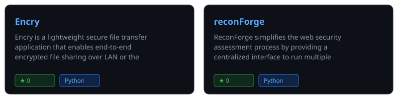

# Hi there, I'm Ashwani Mishra

  

💻 **B.Tech CSE (Cybersecurity)** Student at Parul University  
🌐 **Website:** [ashwanimishra.me](https://ashwanimishra.me)  
🔐 Passionate about **Cybersecurity, Linux & Web Security**  
🛠️ Skilled in **Git, GitHub, Nmap, Burp Suite, Wireshark & Python**  
🚀 Currently building secure applications and exploring Open Source

---

### 📊 GitHub Statistics

  

  

  
  

---

### 📈 Contribution Graph

  

---

### 🧰 Tech Stack

<h4 align="center">Programming & Scripting</h4>

  
  
  
  
  
  

<h4 align="center">Cybersecurity (Offensive & Defensive)</h4>

  
  
  
  
  
  
  
  
  
  

<h4 align="center">Networking & Infrastructure</h4>

  
  
  
  
  
  
  

<h4 align="center">Platforms & Certs</h4>

  
  
  

---

### 📌 About Me

I'm a **1st year B.Tech CSE (Cybersecurity)** student with a deep interest in the intersection of security and development. I focus on vulnerability assessment, network security, and building tools that automate security workflows. I believe in the power of open source and constant learning in the rapidly evolving cybersecurity landscape.

---

### 🚀 Featured Projects

  

#### 🛡️ [Encry](https://github.com/ashwyni-mishra/Encry)
**Lightweight E2E Encrypted File Transfer**
- **Security:** AES-256-GCM authenticated encryption with Scrypt key derivation.
- **Privacy:** Client-side encryption ensures relay servers never see plaintext data.
- **Versatility:** Supports both high-speed LAN transfers and secure internet sharing.

#### 🔍 [ReconForge](https://github.com/ashwyni-mishra/reconForge)
**Web Security Orchestration Framework**
- **Efficiency:** Parallel execution of multiple security scanners (Nmap, Burp, etc.).
- **Correlation:** Centralized interface to aggregate and analyze multi-tool outputs.
- **Automation:** Streamlines the initial phases of penetration testing.

#### 🧪 [CyberHomelab](https://github.com/ashwyni-mishra/cybersecurity-homelab-training)
**Platform-Agnostic Training Framework**
- **Isolation:** Reproducible and secure environments for hands-on SecOps training.
- **Scalability:** Engineered to work across major OSs and hypervisors.
- **Practicality:** Focused on bridging the gap between theory and real-world application.

---

### 📫 Connect With Me

  
  
  

  Last updated: May 2026

